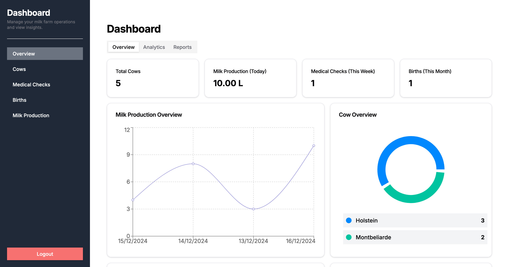
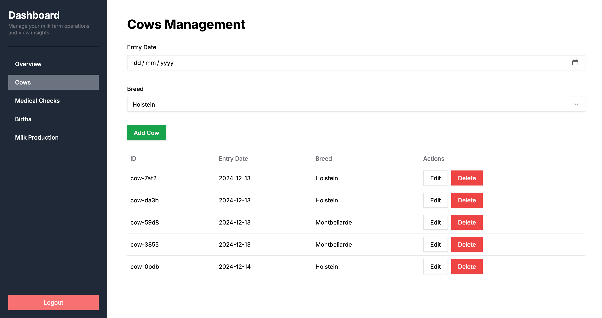
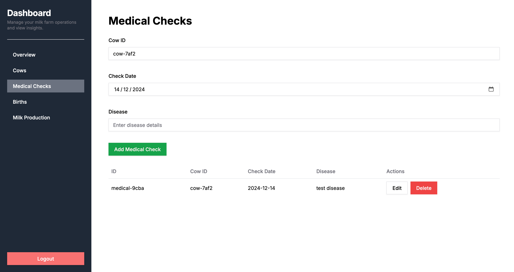
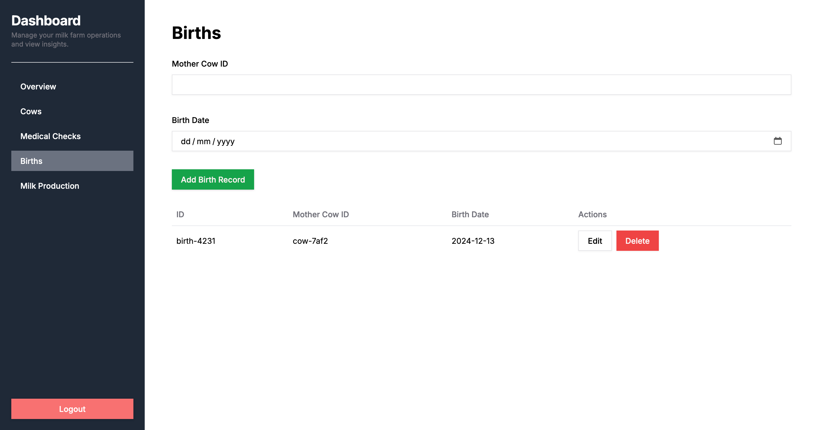
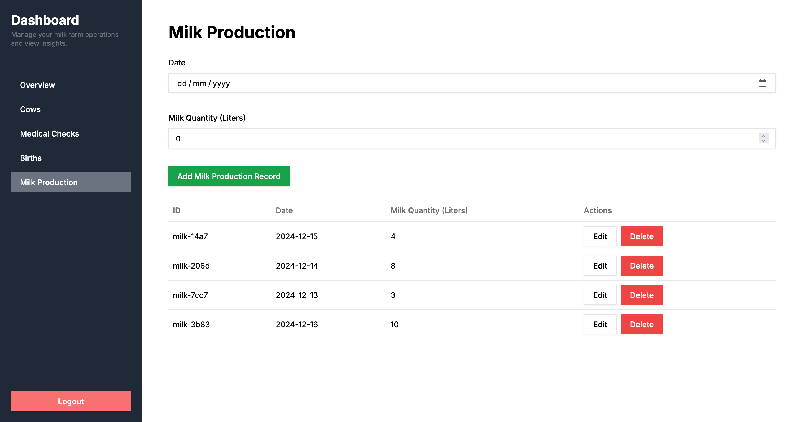
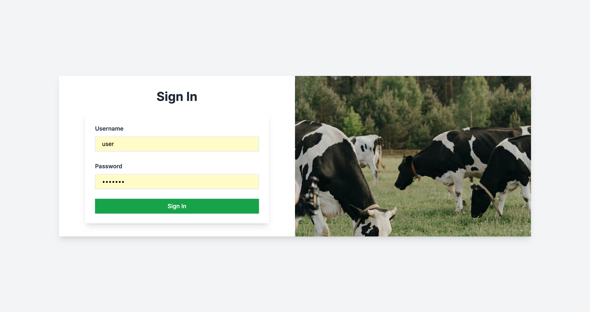
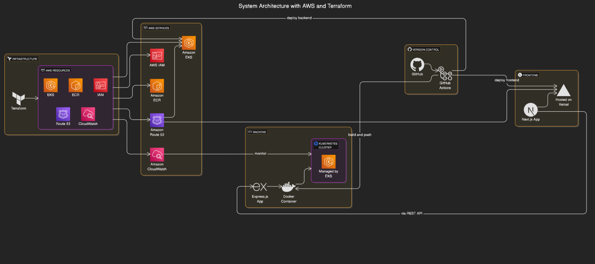

# Cow Farm Management App

## Overview

This project is an App for managing cow farm operations, including cow management, medical checks, births, and milk production. It allows users to perform various operations like adding, updating, and deleting records related to cows, medical checks, births, and milk production.

---

## Table of Contents

1. [Backend Setup](#backend-setup)
2. [Tech Stack](#tech-stack)
3. [Running the App with Docker Compose](#running-the-app-with-docker-compose)
4. [Running the App with kubectl](#running-the-app-with-kubectl)
5. [Preview Screenshots](#preview-screenshots)
6. [System Design Architecture](#system-design-architecture)

   * [Deployment Plan](#deployment-plan)

---

## Backend Setup

### API Documentation

The Cows Farm Management API is built using OpenAPI specifications. You can interact with the API through the following endpoints:

1. **Authentication**:
   * Register a new user: `POST /auth/register`
   * User login: `POST /auth/login`
2. **Cow Management**:
   * Create a new cow: `POST /cows`
   * Get all cows: `GET /cows`
   * Update a cow: `PUT /cows/{id}`
   * Delete a cow: `DELETE /cows/{id}`
3. **Medical Checks**:
   * Create a medical check record: `POST /medical-checks`
   * Get medical checks for a specific cow: `GET /medical-checks/cow/{cowId}`
4. **Birth Records**:
   * Record a new birth: `POST /births`
   * Get birth records for a specific mother cow: `GET /births/cow/{motherCowId}`
5. **Milk Production**:
   * Record milk production: `POST /milk-production`
   * Get milk production by date range: `GET /milk-production`

### Components

The API follows a structured schema to represent entities like cows, medical checks, births, and milk production. JWT-based authentication (Bearer tokens) is used to protect the endpoints.

#### Example Schema

```yaml
Cow:
  type: object
  required:
    - entryDate
    - breed
  properties:
    id:
      type: string
      description: Unique identifier for the cow
      example: "uuid-123-456"
    entryDate:
      type: string
      format: date
      description: Date the cow entered the farm
      example: "2024-01-15"
    breed:
      type: string
      enum:
        - Holstein
        - Montbeliarde
      description: Breed of the cow
      example: "Holstein"
```

---

## Tech Stack

The Cow Farm Management App is built using the following technologies:

* **Frontend**: Next.js
* **Backend**:

  * **Express.js**: Web framework for Node.js, used to handle API requests.
  * **TypeScript**: Type-safe development for both the backend and frontend.
* **Authentication**:

  * JWT (JSON Web Tokens): For secure user authentication.
* **Containerization**:

  * **Docker**: For containerizing the application and ensuring consistency across environments.
  * **Docker Compose**: To define and run multi-container Docker applications.
* **Orchestration**:

  * **Kubernetes**: For managing the deployment and scaling of the application in a cloud environment.
* **Infrastructure as Code**:

  * **Terraform**: For provisioning and managing infrastructure in the cloud.
* **CI/CD**:

  * **GitHub Actions**: For continuous integration and deployment pipelines.
* **Version Control**:

  * **GitHub**: For version control and hosting the codebase.

## Running the App with Docker Compose

1. **Clone the Repository**:

   ```bash
   git clone https://github.com/messabih-khalil/farm-management-system--monolith-architecture-.git
   cd farm-management-system--monolith-architecture-
   ```
2. **Docker Compose Setup**: Make sure you have Docker and Docker Compose installed on your machine. Then, build and start the application using the following commands:

   ```bash
   docker-compose up --build
   ```

   This will build the Docker containers for the backend and start them. The API will be available at `http://localhost:3000/api`.
3. **Environment Variables**: The environment variables required for the API are stored in the `.env` file. Ensure that the file includes the necessary configurations for your database and JWT secret.
4. **Accessing the API**: Once the containers are running, you can access the API documentation through Swagger UI by navigating to:

   ```
   http://localhost:4000/api-docs
   ```

---

## Running the App with kubectl

To deploy and run the application in a Kubernetes cluster, follow these steps:

1. **Prepare Your Kubernetes Cluster**:

   * Ensure you have access to a Kubernetes cluster. You can use:
     - **Minikube** for local development.
     - **Kind (Kubernetes in Docker)** for lightweight Kubernetes clusters.
     - A cloud provider such as AWS EKS, Google GKE, or Azure AKS for production environments.
   * Verify your cluster is running:
     ```bash
     kubectl cluster-info
     ```
2. **Clone the Repository**:

   ```bash
   git clone https://github.com/messabih-khalil/farm-management-system--monolith-architecture-.git
   cd cow-farm-management-api
   ```
3. **Navigate to the Kubernetes Configuration**:
   The Kubernetes manifests for deploying the app are located in the `infra/k8s` folder.

   ```bash
   cd infra/k8s
   ```
4. **Apply the Kubernetes Manifests**:
   Use `kubectl apply` to create the necessary Kubernetes resources, such as Deployments, Services, and ConfigMaps.

   ```bash
   kubectl apply -f .
   ```
5. **Verify Deployment**:
   Check the status of the deployed resources:

   ```bash
   kubectl get pods
   kubectl get services
   ```

   Ensure that all pods are running and services are available.
6. **Access the Application**:

   * If using Minikube or Kind, expose the application by starting a tunnel:
     ```bash
     minikube service <service-name>
     ```
   * For cloud providers, use the external IP address of the LoadBalancer service:
     ```bash
     kubectl get service
     ```
7. **Environment Variables**:

   * Ensure the necessary environment variables are configured in the `ConfigMap` or `Secret` files located in the `infra/k8s` folder.
8. **Clean Up Resources**:
   To remove all resources created for this app:

   ```bash
   kubectl delete -f .
   ```

---

## Preview Screenshots

Here are some screenshots showcasing the user interface and operations of the Cow Farm Management API:

*Overview page showing farm operations.*

*Managing cow details such as breed and entry date.*

*Viewing and managing medical check records for cows.*

*Managing birth records for cows.*

*Tracking and managing milk production data.*

*Login page for accessing the farm management system.*

---

## System Design Architecture

### Overview

The system is designed to manage various farm operations efficiently. It includes user authentication, cow management, medical checks, birth records, and milk production. The backend communicates with a database (e.g., MongoDB or PostgreSQL) to store data persistently.

#### Key Components

* **API**: Handles business logic and exposes RESTful endpoints for frontend communication.
* **Database**: Stores cow data, medical records, birth logs, and milk production statistics.
* **Authentication**: Uses JWT-based Bearer tokens to secure endpoints.
* **API Documentation**: OpenAPI documentation for easy understanding and integration.

---

### Deployment Plan

1. **Cloud Hosting**:
   * The backend can be deployed on cloud platforms like AWS (EC2 or ECS), DigitalOcean, or Heroku.
   * Use Docker to containerize the backend for easy deployment across different environments.
2. **Continuous Integration (CI)**:
   * Set up CI pipelines (e.g., GitHub Actions or GitLab CI) for automated testing and deployment.
3. **Database Management**:
   * Deploy a managed database (e.g., AWS RDS or MongoDB Atlas) for scalability.
   * Use environment variables to manage sensitive information (database URL, JWT secret).
4. **Scalability**:
   * Scale the backend horizontally by adding more Docker containers as demand increases.
   * Use load balancers to distribute traffic efficiently.
5. **Monitoring and Logging**:
   * Use monitoring tools (e.g., Prometheus, Grafana) to track performance and uptime.
   * Implement centralized logging using ELK Stack (Elasticsearch, Logstash, Kibana) or similar tools.



---
